# Queue Management Architecture

This document describes the hybrid queue management architecture used in the application, which combines in-memory operations with optional persistence strategies.

## Architecture Overview

The queue management system is built with these design goals:

1. **Flexibility** - Support both in-memory and persistent storage options
2. **Type Safety** - Use generics for strongly-typed queue items and events
3. **Concurrency** - Handle concurrent operations safely with coroutines
4. **Observability** - Provide reactive state updates with Kotlin Flows
5. **User Interaction** - Support interactive workflows that require user input

## Architecture Diagram

```mermaid
graph TD
    %% Core Components
    subgraph "Core Interfaces"
        QI[QueueItem]
        QP[QueueProcessor]
        QS[QueueStorage]
        BPE[BaseProcessingEvent]
    end
    
    %% Queue Manager
    subgraph "Queue Management"
        HQM[HybridQueueManager]
        PS[PersistenceStrategy]
        PR[ProcessingResult]
        PST[ProcessingState]
        IR[InputRequest]
        IRS[InputResponse]
        
        PS -->|configures| HQM
        HQM -->|returns| PR
        HQM -->|emits| PST
        IR -->|requires| IRS
    end
    
    %% Implementation Examples
    subgraph "Payment Implementation"
        PPQI[ProcessingPaymentQueueItem]
        PPP[PaymentProcessorBase]
        PPS[ProcessingPaymentStorage]
        PPE[ProcessingPaymentEvent]
        PF[ProcessingPaymentQueueFactory]
        
        PPP -.implements.-> QP
        PPQI -.implements.-> QI
        PPS -.implements.-> QS
        PPE -.implements.-> BPE
        
        PF -->|creates| HQM
    end
    
    subgraph "Print Implementation"
        PQI[PrintQueueItem]
        PP[PrintProcessor]
        PS2[PrintStorage]
        PE[PrintingEvent]
        PF2[PrintQueueFactory]
        
        PP -.implements.-> QP
        PQI -.implements.-> QI
        PS2 -.implements.-> QS
        PE -.implements.-> BPE
        
        PF2 -->|creates| HQM
    end
    
    %% Specialized Payment Processors
    subgraph "Payment Processors"
        DPP[DynamicPaymentProcessor]
        APP[AcquirerPaymentProcessor]
        CPP[CashPaymentProcessor]
        TPP[TransactionlessProcessor]
        
        DPP -.extends.-> PPP
        APP -.extends.-> PPP
        CPP -.extends.-> PPP
        TPP -.extends.-> PPP
    end
    
    %% ViewModels
    subgraph "ViewModels"
        PPQVM[ProcessingPaymentQueueViewModel]
        IPVM[InteractivePaymentViewModel]
        MPQVM[MixedPaymentQueueViewModel]
        MQVM[MultiPaymentQueueViewModel]
        PQVM[PrintQueueViewModel]
        
        PPQVM -->|uses| HQM
        IPVM -->|uses| HQM
        MPQVM -->|uses| HQM
        MQVM -->|uses| HQM
        PQVM -->|uses| HQM
    end
    
    %% Relationships
    QI ----> HQM
    QP ----> HQM
    QS ----> HQM
    HQM ----> BPE
    
    %% External dependencies
    DB[(Room Database)]
    PPS -->|stores in| DB
    PS2 -->|stores in| DB
    
    UI[User Interface]
    UI -->|observes| PPQVM
    UI -->|observes| PQVM
    UI -->|sends input| IR
    IRS -->|resolves| IR
    
    %% Style
    classDef interface fill:#f9f,stroke:#333,stroke-width:1px;
    classDef manager fill:#bbf,stroke:#333,stroke-width:1px;
    classDef processor fill:#bfb,stroke:#333,stroke-width:1px;
    classDef viewmodel fill:#fbb,stroke:#333,stroke-width:1px;
    
    class QI,QP,QS,BPE interface;
    class HQM manager;
    class PPP,APP,CPP,TPP,DPP,PP processor;
    class PPQVM,IPVM,MPQVM,MQVM,PQVM viewmodel;
```



## Core Components

### QueueItem
The basic unit of work in the queue system. All queue items must implement this interface to be processable.

```kotlin
interface QueueItem {
    val id: String
    val timestamp: Long
    val priority: Int
    val status: QueueItemStatus
}
```

### QueueProcessor
Processes queue items and returns results. Generic to work with any queue item type.

```kotlin
interface QueueProcessor<T : QueueItem, E : BaseProcessingEvent> {
    val events: SharedFlow<E>
    val inputRequests: SharedFlow<InputRequest>
    suspend fun process(item: T): ProcessingResult
    suspend fun provideInput(response: InputResponse)
}
```

### QueueStorage
Handles persistence of queue items, whether in memory, database, or other storage mechanisms.

```kotlin
interface QueueStorage<T : QueueItem> {
    suspend fun insert(item: T)
    suspend fun getNextPending(): T?
    suspend fun updateStatus(item: T, status: String)
    suspend fun remove(item: T)
    suspend fun getAllByStatus(status: String): List<T>
    fun observeByStatus(status: String): Flow<List<T>>
}
```

### HybridQueueManager
Core class that manages the queue, combining in-memory operations with optional persistence.

```kotlin
class HybridQueueManager<T : QueueItem, E : BaseProcessingEvent>(
    private val storage: QueueStorage<T>,
    internal val processor: QueueProcessor<T, E>,
    private val persistenceStrategy: PersistenceStrategy = PersistenceStrategy.IMMEDIATE,
    private val scope: CoroutineScope = CoroutineScope(Dispatchers.IO + SupervisorJob())
)
```

### PersistenceStrategy
Controls how and when queue items are persisted to storage.

```kotlin
enum class PersistenceStrategy {
    IMMEDIATE,  // Save immediately when items are added or modified
    ON_BACKGROUND,  // Save when app goes to background
    NEVER  // Never save (in-memory only)
}
```

### ProcessingResult
Result of queue item processing, with appropriate states.

```kotlin
sealed class ProcessingResult {
    object Success : ProcessingResult()
    data class Error(val message: String) : ProcessingResult() 
    object Retry : ProcessingResult()
}
```

#### Understanding Retry Mechanisms

**ProcessingResult.Retry vs ErrorHandlingAction**

The queue system has two distinct retry mechanisms that serve different purposes:

1. **ProcessingResult.Retry**:
   - Returned by the processor itself during processing
   - Indicates an automatic retry should be attempted without user intervention
   - Used for transient issues that the processor believes can resolve automatically
   - Examples: temporary network issues, hardware resets, or situations where the processor wants to try again with different parameters
   - This is a processor-initiated decision

2. **ErrorHandlingAction (RETRY_IMMEDIATELY, RETRY_LATER)**:
   - User-initiated actions in response to an error that the processor couldn't handle
   - Comes into play after a processor has already failed (returned `ProcessingResult.Error`)
   - Requires user interaction through the UI to decide how to proceed
   - Provides more options: retry now, retry later, abort current processor, or abort all processors
   - This is a user-initiated decision

In summary:
- `ProcessingResult.Retry`: "I (the processor) need to try again automatically"
- `ErrorHandlingAction.RETRY_IMMEDIATELY`: "The user wants to retry the failed processor right now"
- `ErrorHandlingAction.RETRY_LATER`: "The user wants to move this item to the end of the queue and try again later"

This separation allows for both automatic retries by the processor and user-directed retries after failures, providing flexibility in handling different error scenarios.

### BaseProcessingEvent
Base interface for processor-specific events.

```kotlin
interface BaseProcessingEvent {
    val timestamp: Long
}
```

## Special Features

### User Input Support
The architecture supports processors that require user input during execution:

- `InputRequest`: Represents a request for user input (e.g., PIN entry, signature)
- `InputResponse`: The user's response to an input request

This enables interactive workflows where processing can be suspended, waiting for user action.

### Dynamic Payment Processor
The `DynamicPaymentProcessor` can delegate processing to different payment processor implementations based on the payment type field in the queue item. This allows for handling mixed payment types in a single queue.

## Implementation Examples

### Payment Queue
- `ProcessingPaymentQueueItem`: Implementation of QueueItem for payments
- `PaymentProcessorBase`: Base class for payment processors
- `ProcessingPaymentStorage`: Room-based storage for payment queue items
- `ProcessingPaymentQueueFactory`: Factory to create a configured payment queue

### Print Queue
- `PrintQueueItem`: Implementation of QueueItem for print jobs
- `PrintProcessor`: Processor for print jobs
- `PrintStorage`: Room-based storage for print queue items
- `PrintQueueFactory`: Factory to create a configured print queue

## Usage Example

```kotlin
// Create a payment queue with a specific processor and storage
val paymentQueue = ProcessingPaymentQueueFactory.create(
    processor = AcquirerPaymentProcessor(),
    storage = ProcessingPaymentStorage(database),
    persistenceStrategy = PersistenceStrategy.IMMEDIATE
)

// Enqueue an item
paymentQueue.enqueue(paymentItem)

// Observe queue state changes
paymentQueue.queueState.collect { items ->
    // Update UI with current queue items
}

// Observe processing state
paymentQueue.processingState.collect { state ->
    when (state) {
        is ProcessingState.Processing -> // Show processing UI
        is ProcessingState.Completed -> // Show success UI
        is ProcessingState.Failed -> // Show error UI
        is ProcessingState.Retrying -> // Show retry UI
        null -> // No active processing
    }
}

// Handle processor-specific events
paymentQueue.processorEvents.collect { event ->
    when (event) {
        is ProcessingPaymentEvent.CardDetected -> // Show card detected UI
        is ProcessingPaymentEvent.AmountConfirmed -> // Show amount confirmed UI
        // Other event types...
    }
}

// Provide user input when requested
paymentQueue.processor.inputRequests.collect { request ->
    when (request) {
        is InputRequest.PIN -> {
            // Show PIN entry UI
            val pin = showPinEntryDialog()
            paymentQueue.processor.provideInput(InputResponse.PIN(pin))
        }
        is InputRequest.Signature -> {
            // Show signature capture UI
            val signature = captureSignature()
            paymentQueue.processor.provideInput(InputResponse.Signature(signature))
        }
        // Other input request types...
    }
}
```

## Notification Channels (Flows)

The queue system uses Kotlin Flows as notification channels for reactive communication between components. Here are the main flows available:

### 1. Queue State Flow (`queueState`)

**Purpose**: Emits the current state of the queue (list of items).

**Type**: `StateFlow<List<QueueItem>>`

**Example Values**:
```kotlin
[
  ProcessingPaymentQueueItem(id="payment1", status="pending", amount=100.0),
  ProcessingPaymentQueueItem(id="payment2", status="pending", amount=50.0)
]
```

**How to React**:
```kotlin
paymentQueue.queueState.collect { items ->
  // Update UI with queue items
  recyclerAdapter.submitList(items)
  
  // Show/hide empty state
  emptyStateView.isVisible = items.isEmpty()
  
  // Update queue count
  queueCountTextView.text = "${items.size} items in queue"
}
```

### 2. Processing State Flow (`processingState`)

**Purpose**: Emits the current processing state of the queue.

**Type**: `StateFlow<ProcessingState<QueueItem>>`

**Example Values**:
```kotlin
ProcessingState.QueueIdle(item) // Queue is idle with next item ready
ProcessingState.ItemProcessing(item) // Item is being processed
ProcessingState.ItemDone(item) // Item was successfully processed
ProcessingState.ItemFailed(item, error) // Processing failed with error
ProcessingState.ItemRetrying(item) // Item is being retried
ProcessingState.ItemSkipped(item) // Item was skipped but remains in queue
ProcessingState.QueueCanceled // All processing was canceled
ProcessingState.QueueDone // All items in queue have been processed
```

**How to React**:
```kotlin
paymentQueue.processingState.collect { state ->
  when (state) {
    is ProcessingState.Idle -> {
      statusTextView.text = "Ready to process"
      progressBar.isVisible = false
    }
    is ProcessingState.Processing -> {
      val item = state.item
      statusTextView.text = "Processing payment ${item.id}"
      progressBar.isVisible = true
    }
    is ProcessingState.Completed -> {
      val item = state.item
      statusTextView.text = "Completed payment ${item.id}"
      progressBar.isVisible = false
      showSuccessAnimation()
    }
    is ProcessingState.Failed -> {
      val item = state.item
      val error = state.error
      statusTextView.text = "Failed: ${error.message}"
      progressBar.isVisible = false
      showErrorDialog(error)
    }
    is ProcessingState.Retrying -> {
      val item = state.item
      statusTextView.text = "Retrying payment ${item.id}"
      progressBar.isVisible = true
    }
    is ProcessingState.Skipped -> {
      val item = state.item
      statusTextView.text = "Skipped payment ${item.id}"
      progressBar.isVisible = false
    }
    is ProcessingState.Canceled -> {
      statusTextView.text = "Processing canceled"
      progressBar.isVisible = false
      showCanceledMessage()
    }
  }
}
```

### 3. Processor Events Flow (`processorEvents`)

**Purpose**: Emits processor-specific events during processing.

**Type**: `SharedFlow<ProcessorEvent>` (e.g., `ProcessingPaymentEvent`)

**Example Values**:
```kotlin
ProcessingPaymentEvent.CardDetected(cardType="MASTERCARD")
ProcessingPaymentEvent.AmountConfirmed(amount=100.0)
ProcessingPaymentEvent.ProcessingStarted(paymentId="payment1")
ProcessingPaymentEvent.TransactionApproved(authCode="123456")
ProcessingPaymentEvent.PrintingReceipt()
```

**How to React**:
```kotlin
paymentQueue.processorEvents.collect { event ->
  when (event) {
    is ProcessingPaymentEvent.CardDetected -> {
      cardTypeTextView.text = "Card: ${event.cardType}"
      showCardAnimation(event.cardType)
    }
    is ProcessingPaymentEvent.AmountConfirmed -> {
      amountTextView.text = "Amount: $${event.amount}"
    }
    is ProcessingPaymentEvent.TransactionApproved -> {
      authCodeTextView.text = "Auth: ${event.authCode}"
      showApprovedAnimation()
    }
    is ProcessingPaymentEvent.PrintingReceipt -> {
      statusTextView.text = "Printing receipt..."
      showPrintingAnimation()
    }
    // Handle other event types...
  }
}
```

### 4. Queue Input Requests Flow (`queueInputRequests`)

**Purpose**: Emits requests for user input at the queue level (e.g., confirmation, error handling).

**Type**: `SharedFlow<QueueInputRequest>`

**Example Values**:
```kotlin
QueueInputRequest.Confirmation(
  id="req1",
  title="Confirm Next Processor",
  message="Ready to process payment. Continue?"
)

QueueInputRequest.ErrorRetryOrSkip(
  id="req2",
  title="Payment Failed",
  message="Card declined. What would you like to do?",
  error=ProcessingPaymentErrorEvent.CARD_DECLINED
)
```

**How to React**:
```kotlin
paymentQueue.queueInputRequests.collect { request ->
  when (request) {
    is QueueInputRequest.Confirmation -> {
      showConfirmationDialog(
        title = request.title,
        message = request.message,
        onConfirm = {
          viewModel.confirmNextProcessor(request.id)
        },
        onCancel = {
          viewModel.cancelNextProcessor(request.id)
        }
      )
    }
    is QueueInputRequest.ErrorRetryOrSkip -> {
      showErrorOptionsDialog(
        title = request.title,
        message = request.message,
        onRetryImmediately = {
          viewModel.retryFailedPaymentImmediately(request.id)
        },
        onRetryLater = {
          viewModel.retryFailedPaymentLater(request.id)
        },
        onAbortCurrent = {
          viewModel.abortCurrentProcessor(request.id)
        },
        onAbortAll = {
          viewModel.abortAllProcessors(request.id)
        }
      )
    }
  }
}
```

### 5. Input Requests Flow (`inputRequests`)

**Purpose**: Emits requests for user input at the processor level (e.g., PIN entry, signature).

**Type**: `SharedFlow<InputRequest>`

**Example Values**:
```kotlin
InputRequest.PIN(
  id="pin1",
  message="Please enter PIN"
)

InputRequest.Signature(
  id="sig1",
  message="Please sign",
  amount=100.0
)

InputRequest.Confirmation(
  id="conf1",
  message="Confirm amount $100.00?"
)
```

**How to React**:
```kotlin
paymentQueue.processor.inputRequests.collect { request ->
  when (request) {
    is InputRequest.PIN -> {
      showPinEntryDialog(
        message = request.message,
        onPinEntered = { pin ->
          viewModel.providePinInput(request.id, pin)
        },
        onCancel = {
          viewModel.cancelInput(request.id)
        }
      )
    }
    is InputRequest.Signature -> {
      showSignatureScreen(
        amount = request.amount,
        onSignatureCapture = { signatureData ->
          viewModel.provideSignatureInput(request.id, signatureData)
        },
        onCancel = {
          viewModel.cancelInput(request.id)
        }
      )
    }
    is InputRequest.Confirmation -> {
      showConfirmDialog(
        message = request.message,
        onConfirm = {
          viewModel.provideConfirmationInput(request.id, true)
        },
        onReject = {
          viewModel.provideConfirmationInput(request.id, false)
        }
      )
    }
  }
}
```

## Benefits

1. **Hybrid Performance**: Combines the speed of in-memory operations with the durability of persistence
2. **Flexible Persistence**: Choose when and how items are persisted based on application needs
3. **Type Safety**: Generic interfaces ensure type safety throughout the queue system
4. **Reactive Design**: Kotlin Flow integration for reactive state updates
5. **Interactive Processing**: Support for processes that require user interaction
6. **Extensibility**: Easy to add new queue types or processor implementations
