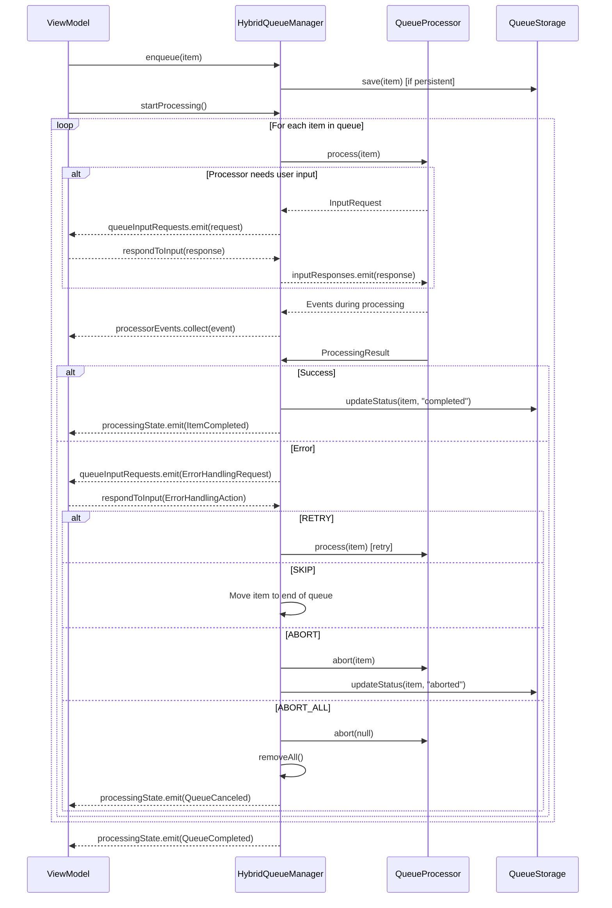
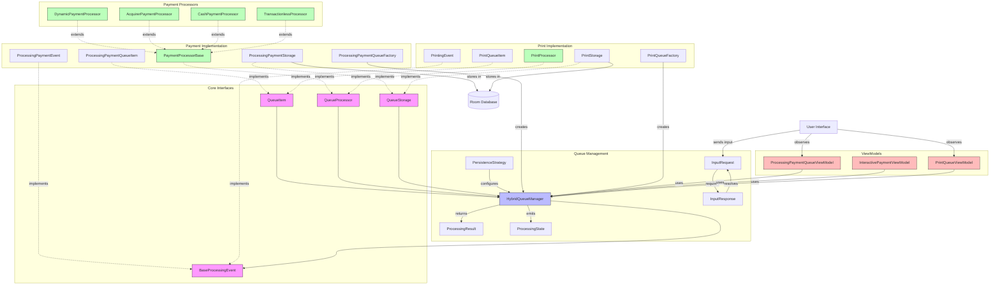

# Queue Management Architecture

This document describes the hybrid queue management architecture used in the application, which combines in-memory operations with optional persistence strategies.

## Architecture Overview

The queue management system is built with these design goals:

1. **Flexibility** - Support both in-memory and persistent storage options
2. **Type Safety** - Use generics for strongly-typed queue items and events
3. **Concurrency** - Handle concurrent operations safely with coroutines
4. **Observability** - Provide reactive state updates with Kotlin Flows
5. **User Interaction** - Support interactive workflows that require user input

## Execution Flow Diagram



## Architecture Diagram



## Core Components

### QueueItem
The basic unit of work in the queue system. All queue items must implement this interface to be processable.

```kotlin
interface QueueItem {
    val id: String
    val priority: Int
    var status: QueueItemStatus
}

enum class QueueItemStatus {
    PENDING,    // Item is waiting to be processed
    PROCESSING, // Item is currently being processed
    COMPLETED,  // Item has been processed successfully
    FAILED,     // Item processing failed
    CANCELLED   // Item processing was cancelled
}
```

### QueueProcessor
Processes queue items and returns results. Generic to work with any queue item type.

```kotlin
interface QueueProcessor<T : QueueItem, E : BaseProcessingEvent> {
    val events: SharedFlow<E>
    val userInputRequests: SharedFlow<UserInputRequest>
    
    suspend fun process(item: T): ProcessingResult
    suspend fun provideUserInput(response: UserInputResponse)
    suspend fun abort(item: T? = null): Boolean
}
```

### QueueStorage
Handles persistence of queue items, whether in memory, database, or other storage mechanisms.

```kotlin
interface QueueStorage<T : QueueItem> {
    suspend fun insert(item: T)
    suspend fun update(item: T)
    suspend fun remove(item: T)
    suspend fun updateStatus(item: T, status: QueueItemStatus)
    suspend fun removeByStatus(statuses: List<QueueItemStatus>)
    suspend fun getNextPending(): T?
    suspend fun getAllByStatus(status: QueueItemStatus): List<T>
    fun observeByStatus(status: QueueItemStatus): Flow<List<T>>
}
```

### HybridQueueManager
Core class that manages the queue, combining in-memory operations with optional persistence.

```kotlin
class HybridQueueManager<T : QueueItem, E : BaseProcessingEvent>(
    private val storage: QueueStorage<T>,
    internal val processor: QueueProcessor<T, E>,
    private val persistenceStrategy: PersistenceStrategy = PersistenceStrategy.IMMEDIATE,
    private val scope: CoroutineScope = CoroutineScope(Dispatchers.IO + SupervisorJob())
)
```

### PersistenceStrategy
Controls how and when queue items are persisted to storage.

```kotlin
enum class PersistenceStrategy {
    IMMEDIATE,  // Save immediately when items are added or modified
    ON_BACKGROUND,  // Save when app goes to background
    NEVER  // Never save (in-memory only)
}
```

### ProcessingResult
Result of queue item processing, with appropriate states.

```kotlin
sealed class ProcessingResult {
    class Success(
        val atk: String,
        val txId: String,
    ) : ProcessingResult()
    
    data class Error(
        val event: ProcessingErrorEvent
    ) : ProcessingResult()
}
```

#### Understanding Error Handling

**ProcessingResult.Error vs ErrorHandlingAction**

The queue system handles errors through a structured approach:

1. **ProcessingResult.Error**:
   - Returned by the processor when processing fails
   - Contains a `ProcessingErrorEvent` with detailed error information
   - Triggers the queue manager to request user input for error handling
   - Example: Payment declined, card read error, network failure

2. **ErrorHandlingAction**:
   - User-initiated response to a processing error
   - Available actions: RETRY, SKIP, ABORT, ABORT_ALL
   - Triggered when the user chooses how to handle the error
   - Example: User sees payment declined error and chooses to retry or skip

This separation allows processors to report detailed errors while giving users control over how to proceed.

### BaseProcessingEvent
Base interface for processor-specific events.

```kotlin
interface BaseProcessingEvent {
    val timestamp: Long
}
```

## Special Features

### User Input Support
The architecture supports processors that require user input during execution:

```kotlin
// Request user input (processor-level)
val response = requestUserInput(UserInputRequest.CONFIRM_CUSTOMER_RECEIPT_PRINTING())

// Use the response
val confirmed = response.value as? Boolean ?: false
if (confirmed) {
    // Continue with receipt printing
}

// Available UserInputRequest types:
// - CONFIRM_CUSTOMER_RECEIPT_PRINTING
// - CONFIRM_MERCHANT_PIX_KEY  
// - MERCHANT_PIX_SCANNING(pixCode)

// Queue-level input requests
val queueResponse = requestQueueInput(QueueInputRequest.CONFIRM_NEXT_PROCESSOR(...))
```

This enables interactive workflows where processing can be suspended, waiting for user action.

### Dynamic Payment Processor
The `DynamicPaymentProcessor` can delegate processing to different payment processor implementations based on the payment type field in the queue item. This allows for handling mixed payment types in a single queue.

## Implementation Examples

### Payment Queue
- `ProcessingPaymentQueueItem`: Implementation of QueueItem for payments
- `PaymentProcessorBase`: Base class for payment processors
- `ProcessingPaymentStorage`: Room-based storage for payment queue items
- `ProcessingPaymentQueueFactory`: Factory to create a configured payment queue

### Print Queue
- `PrintQueueItem`: Implementation of QueueItem for print jobs
- `PrintProcessor`: Processor for print jobs
- `PrintStorage`: Room-based storage for print queue items
- `PrintQueueFactory`: Factory to create a configured print queue

## Usage Example

```kotlin
// Create a dynamic payment queue that handles multiple payment types
val paymentQueue = ProcessingPaymentQueueFactory().createDynamicPaymentQueue(
    storage = ProcessingPaymentStorage(dao),
    persistenceStrategy = PersistenceStrategy.IMMEDIATE,
    startMode = ProcessorStartMode.IMMEDIATE,
    scope = viewModelScope
)

// Enqueue an item
paymentQueue.enqueue(paymentItem)

// Observe queue state changes
paymentQueue.queueState.collect { items ->
    // Update UI with current queue items
}

// Observe processing state
paymentQueue.processingState.collect { state ->
    when (state) {
        is ProcessingState.QueueIdle -> {
            statusTextView.text = "Ready to process"
            progressBar.isVisible = false
        }
        is ProcessingState.ItemProcessing -> {
            val item = state.item
            statusTextView.text = "Processing payment ${item.id}"
            progressBar.isVisible = true
        }
        is ProcessingState.ItemDone -> {
            val item = state.item
            statusTextView.text = "Completed payment ${item.id}"
            progressBar.isVisible = false
            showSuccessAnimation()
        }
        is ProcessingState.ItemFailed -> {
            val item = state.item
            val error = state.error
            statusTextView.text = "Failed: ${error}"
            progressBar.isVisible = false
            showErrorDialog(error)
        }
        is ProcessingState.ItemRetrying -> {
            val item = state.item
            statusTextView.text = "Retrying payment ${item.id}"
            progressBar.isVisible = true
        }
        is ProcessingState.ItemSkipped -> {
            val item = state.item
            statusTextView.text = "Skipped payment ${item.id}"
            progressBar.isVisible = false
        }
        is ProcessingState.ItemAborted -> {
            val item = state.item
            statusTextView.text = "Aborted payment ${item.id}"
            progressBar.isVisible = false
        }
        is ProcessingState.QueueCanceled -> {
            statusTextView.text = "Processing canceled"
            progressBar.isVisible = false
            showCanceledMessage()
        }
        is ProcessingState.QueueDone -> {
            statusTextView.text = "All payments completed"
            progressBar.isVisible = false
        }
        is ProcessingState.QueueAborted -> {
            statusTextView.text = "Queue aborted"
            progressBar.isVisible = false
        }
    }
}

// Handle processor-specific events
paymentQueue.processorEvents.collect { event ->
    when (event) {
        ProcessingPaymentEvent.START -> {
            statusTextView.text = "Payment started"
        }
        ProcessingPaymentEvent.CARD_REACH_OR_INSERT -> {
            statusTextView.text = "Please insert or reach your card"
            showCardAnimation()
        }
        ProcessingPaymentEvent.TRANSACTION_PROCESSING -> {
            statusTextView.text = "Processing transaction..."
            showProcessingAnimation()
        }
        ProcessingPaymentEvent.APPROVAL_SUCCEEDED -> {
            statusTextView.text = "Transaction approved"
            showApprovedAnimation()
        }
        ProcessingPaymentEvent.APPROVAL_DECLINED -> {
            statusTextView.text = "Transaction declined"
            showDeclinedAnimation()
        }
        ProcessingPaymentEvent.TRANSACTION_DONE -> {
            statusTextView.text = "Transaction completed"
        }
        ProcessingPaymentEvent.PIN_REQUESTED -> {
            statusTextView.text = "Please enter your PIN"
        }
        ProcessingPaymentEvent.CANCELLED -> {
            statusTextView.text = "Payment cancelled"
        }
        // Handle other event types...
    }
}

// Provide user input when requested (processor-level)
paymentQueue.processor.userInputRequests.collect { request ->
    when (request) {
        is UserInputRequest.CONFIRM_CUSTOMER_RECEIPT_PRINTING -> {
            // Show receipt printing confirmation
            val confirmed = showReceiptConfirmationDialog()
            paymentQueue.processor.provideUserInput(
                UserInputResponse(request.id, confirmed)
            )
        }
        is UserInputRequest.CONFIRM_MERCHANT_PIX_KEY -> {
            // Show PIX key confirmation
            val pixKey = showPixKeyDialog()
            paymentQueue.processor.provideUserInput(
                UserInputResponse(request.id, pixKey)
            )
        }
        is UserInputRequest.MERCHANT_PIX_SCANNING -> {
            // Show PIX QR code scanning
            val scanned = showPixScanningDialog(request.pixCode)
            paymentQueue.processor.provideUserInput(
                UserInputResponse(request.id, scanned)
            )
        }
    }
}

// Handle queue-level input requests
paymentQueue.queueInputRequests.collect { request ->
    when (request) {
        is QueueInputRequest.CONFIRM_NEXT_PROCESSOR -> {
            // Show next processor confirmation
            val shouldProceed = showNextProcessorDialog(
                currentIndex = request.currentItemIndex,
                totalItems = request.totalItems
            )
            val response = if (shouldProceed) {
                QueueInputResponse.proceed(request.id)
            } else {
                QueueInputResponse.skip(request.id)
            }
            paymentQueue.provideQueueInput(response)
        }
        is QueueInputRequest.ERROR_RETRY_OR_SKIP -> {
            // Show error handling options
            val action = showErrorHandlingDialog(request.error)
            val response = when (action) {
                ErrorHandlingAction.RETRY -> QueueInputResponse.onErrorRetry(request.id)
                ErrorHandlingAction.SKIP -> QueueInputResponse.onErrorSkip(request.id)
                ErrorHandlingAction.ABORT -> QueueInputResponse.onErrorAbort(request.id)
                ErrorHandlingAction.ABORT_ALL -> QueueInputResponse.onErrorAbortAll(request.id)
            }
            paymentQueue.provideQueueInput(response)
        }
    }
}
```

## Notification Channels (Flows)

The queue system uses Kotlin Flows as notification channels for reactive communication between components. Here are the main flows available:

### 1. Queue State Flow (`queueState`)

**Purpose**: Emits the current state of the queue (list of items).

**Type**: `StateFlow<List<QueueItem>>`

**Example Values**:
```kotlin
[
  ProcessingPaymentQueueItem(id="payment1", status="pending", amount=100.0),
  ProcessingPaymentQueueItem(id="payment2", status="pending", amount=50.0)
]
```

**How to React**:
```kotlin
paymentQueue.queueState.collect { items ->
  // Update UI with queue items
  recyclerAdapter.submitList(items)
  
  // Show/hide empty state
  emptyStateView.isVisible = items.isEmpty()
  
  // Update queue count
  queueCountTextView.text = "${items.size} items in queue"
}
```

### 2. Processing State Flow (`processingState`)

**Purpose**: Emits the current processing state of the queue.

**Type**: `StateFlow<ProcessingState<QueueItem>>`

**Example Values**:
```kotlin
ProcessingState.QueueIdle(item) // Queue is idle with next item ready
ProcessingState.ItemProcessing(item) // Item is being processed
ProcessingState.ItemDone(item) // Item was successfully processed
ProcessingState.ItemFailed(item, error) // Processing failed with error
ProcessingState.ItemRetrying(item) // Item is being retried
ProcessingState.ItemSkipped(item) // Item was skipped but remains in queue
ProcessingState.QueueCanceled // All processing was canceled
ProcessingState.QueueDone // All items in queue have been processed
```

**How to React**:
```kotlin
paymentQueue.processingState.collect { state ->
  when (state) {
    is ProcessingState.Idle -> {
      statusTextView.text = "Ready to process"
      progressBar.isVisible = false
    }
    is ProcessingState.Processing -> {
      val item = state.item
      statusTextView.text = "Processing payment ${item.id}"
      progressBar.isVisible = true
    }
    is ProcessingState.Completed -> {
      val item = state.item
      statusTextView.text = "Completed payment ${item.id}"
      progressBar.isVisible = false
      showSuccessAnimation()
    }
    is ProcessingState.Failed -> {
      val item = state.item
      val error = state.error
      statusTextView.text = "Failed: ${error.message}"
      progressBar.isVisible = false
      showErrorDialog(error)
    }
    is ProcessingState.Retrying -> {
      val item = state.item
      statusTextView.text = "Retrying payment ${item.id}"
      progressBar.isVisible = true
    }
    is ProcessingState.Skipped -> {
      val item = state.item
      statusTextView.text = "Skipped payment ${item.id}"
      progressBar.isVisible = false
    }
    is ProcessingState.Canceled -> {
      statusTextView.text = "Processing canceled"
      progressBar.isVisible = false
      showCanceledMessage()
    }
  }
}
```

### 3. Processor Events Flow (`processorEvents`)

**Purpose**: Emits processor-specific events during processing.

**Type**: `SharedFlow<ProcessorEvent>` (e.g., `ProcessingPaymentEvent`)

**Example Values**:
```kotlin
ProcessingPaymentEvent.CardDetected(cardType="MASTERCARD")
ProcessingPaymentEvent.AmountConfirmed(amount=100.0)
ProcessingPaymentEvent.ProcessingStarted(paymentId="payment1")
ProcessingPaymentEvent.TransactionApproved(authCode="123456")
ProcessingPaymentEvent.PrintingReceipt()
```

**How to React**:
```kotlin
paymentQueue.processorEvents.collect { event ->
  when (event) {
    is ProcessingPaymentEvent.CardDetected -> {
      cardTypeTextView.text = "Card: ${event.cardType}"
      showCardAnimation(event.cardType)
    }
    is ProcessingPaymentEvent.AmountConfirmed -> {
      amountTextView.text = "Amount: $${event.amount}"
    }
    is ProcessingPaymentEvent.TransactionApproved -> {
      authCodeTextView.text = "Auth: ${event.authCode}"
      showApprovedAnimation()
    }
    is ProcessingPaymentEvent.PrintingReceipt -> {
      statusTextView.text = "Printing receipt..."
      showPrintingAnimation()
    }
    // Handle other event types...
  }
}
```

### 4. Queue Input Requests Flow (`queueInputRequests`)

**Purpose**: Emits requests for user input at the queue level (e.g., confirmation, error handling).

**Type**: `SharedFlow<QueueInputRequest>`

**Example Values**:
```kotlin
QueueInputRequest.Confirmation(
  id="req1",
  title="Confirm Next Processor",
  message="Ready to process payment. Continue?"
)

QueueInputRequest.ErrorRetryOrSkip(
  id="req2",
  title="Payment Failed",
  message="Card declined. What would you like to do?",
  error=ProcessingPaymentErrorEvent.CARD_DECLINED
)
```

**How to React**:
```kotlin
paymentQueue.queueInputRequests.collect { request ->
  when (request) {
    is QueueInputRequest.Confirmation -> {
      showConfirmationDialog(
        title = request.title,
        message = request.message,
        onConfirm = {
          viewModel.confirmNextProcessor(request.id)
        },
        onCancel = {
          viewModel.cancelNextProcessor(request.id)
        }
      )
    }
    is QueueInputRequest.ErrorRetryOrSkip -> {
      showErrorOptionsDialog(
        title = request.title,
        message = request.message,
        onRetryImmediately = {
          viewModel.retryFailedPaymentImmediately(request.id)
        },
        ononSkip = {
          viewModel.retryFailedPaymentLater(request.id)
        },
        onAbortCurrent = {
          viewModel.abortCurrentProcessor(request.id)
        },
        onAbortAll = {
          viewModel.abortAllProcessors(request.id)
        }
      )
    }
  }
}
```

### 5. Input Requests Flow (`inputRequests`)

**Purpose**: Emits requests for user input at the processor level (e.g., PIN entry, signature).

**Type**: `SharedFlow<InputRequest>`

**Example Values**:
```kotlin
InputRequest.PIN(
  id="pin1",
  message="Please enter PIN"
)

InputRequest.Signature(
  id="sig1",
  message="Please sign",
  amount=100.0
)

InputRequest.Confirmation(
  id="conf1",
  message="Confirm amount $100.00?"
)
```

**How to React**:
```kotlin
paymentQueue.processor.inputRequests.collect { request ->
  when (request) {
    is InputRequest.PIN -> {
      showPinEntryDialog(
        message = request.message,
        onPinEntered = { pin ->
          viewModel.providePinInput(request.id, pin)
        },
        onCancel = {
          viewModel.cancelInput(request.id)
        }
      )
    }
    is InputRequest.Signature -> {
      showSignatureScreen(
        amount = request.amount,
        onSignatureCapture = { signatureData ->
          viewModel.provideSignatureInput(request.id, signatureData)
        },
        onCancel = {
          viewModel.cancelInput(request.id)
        }
      )
    }
    is InputRequest.Confirmation -> {
      showConfirmDialog(
        message = request.message,
        onConfirm = {
          viewModel.provideConfirmationInput(request.id, true)
        },
        onReject = {
          viewModel.provideConfirmationInput(request.id, false)
        }
      )
    }
  }
}
```

## Input Request Handling Guide

This section provides a comprehensive guide on how to create, listen, react, and respond to input requests in the queue system.

### 1. Creating Input Requests (Processor Side)

Input requests are created by payment processors when they need user interaction. There are two types of input requests:

#### Queue-Level Input Requests
Handled by the `HybridQueueManager` and used for queue management operations.

```kotlin
// Inside a QueueProcessor implementation
val request = QueueInputRequest.Confirmation(
  id = UUID.randomUUID().toString(),
  title = "Confirm PaymentProcessingAction",
  message = "Are you sure you want to proceed?"
)

// The HybridQueueManager will emit this request to its queueInputRequests flow
```

#### Processor-Level Input Requests
Handled directly by the processor operations.

```kotlin
// Inside a PaymentProcessorBase subclass
override suspend fun processPayment(item: ProcessingPaymentQueueItem): ProcessingResult {
  // Create an input request
  val request = InputRequest.CONFIRM_MERCHANT_PIX_KEY(
    id = UUID.randomUUID().toString(),
    message = "Enter your PIX key",
    timeoutMs = 60000L // Optional timeout in milliseconds
  )
  
  // Emit the request and wait for response
  val response = requestInput(request)
  
  // Check if the request was canceled or timed out
  if (response.isCanceled) {
    return ProcessingResult.Error(ProcessingErrorEvent.USER_CANCELED)
  }
  if (response.isTimeout) {
    return ProcessingResult.Error(ProcessingErrorEvent.TIMEOUT)
  }
  
  // Use the response value
  val pixKey = response.value as String
  // Continue processing with the PIX key
  // ...
}
```

### 2. Listening for Input Requests (UI Side)

The UI needs to listen for both queue-level and processor-level input requests:

#### Queue-Level Input Requests

```kotlin
// In your ViewModel
fun observeQueueInputRequests() {
  viewModelScope.launch {
    paymentQueue.queueInputRequests.collect { request ->
      // Dispatch an action to update UI state
      dispatch(Action.QueueInputRequested(request))
    }
  }
}
```

#### Processor-Level Input Requests

```kotlin
// In your ViewModel
fun observeProcessorInputRequests() {
  viewModelScope.launch {
    paymentQueue.processor.inputRequests.collect { request ->
      // Dispatch an action to update UI state
      dispatch(Action.ProcessorInputRequested(request))
    }
  }
}
```

### 3. Reacting to Input Requests (UI Side)

The UI state should be updated based on the input request type:

```kotlin
// In your Reducer
fun reduce(state: UiState, action: Action): UiState {
  return when (action) {
    is Action.QueueInputRequested -> {
      when (action.request) {
        is QueueInputRequest.Confirmation -> {
          UiState.ConfirmNextProcessor(action.request)
        }
        is QueueInputRequest.ErrorRetryOrSkip -> {
          UiState.HandleProcessingError(action.request)
        }
        // Handle other queue input request types
      }
    }
    is Action.ProcessorInputRequested -> {
      when (action.request) {
        is InputRequest.PIN -> {
          UiState.EnterPin(action.request)
        }
        is InputRequest.CONFIRM_MERCHANT_PIX_KEY -> {
          UiState.ConfirmMerchantPixKey(action.request)
        }
        // Handle other processor input request types
      }
    }
    // Handle other actions
  }
}
```

### 4. Displaying UI for Input Requests (Activity/Fragment)

Based on the UI state, display the appropriate UI component:

```kotlin
// In your Activity/Fragment
viewModel.uiState.collect { state ->
  when (state) {
    is UiState.ConfirmMerchantPixKey -> {
      showPixKeyDialog(
        request = state.request,
        onConfirm = { pixKey ->
          viewModel.confirmMerchantPixKey(state.request.id, pixKey)
        },
        onCancel = {
          viewModel.cancelInput(state.request.id)
        }
      )
    }
    // Handle other UI states
  }
}

private fun showPixKeyDialog(request: InputRequest.CONFIRM_MERCHANT_PIX_KEY, onConfirm: (String) -> Unit, onCancel: () -> Unit) {
  val dialog = MaterialAlertDialogBuilder(this)
    .setTitle(R.string.pix_key_dialog_title)
    .setView(R.layout.dialog_pix_key_input)
    .setPositiveButton(R.string.confirm) { _, _ -> 
      // Dialog view is inflated and shown
      val pixKeyEditText = dialog.findViewById<EditText>(R.id.pixKeyEditText)
      onConfirm(pixKeyEditText.text.toString())
    }
    .setNegativeButton(R.string.cancel) { _, _ -> onCancel() }
    .setCancelable(false)
    .create()
  
  dialog.show()
}
```

### 5. Responding to Input Requests (ViewModel)

Provide methods in the ViewModel to handle user responses:

```kotlin
// In your ViewModel
fun confirmMerchantPixKey(requestId: String, pixKey: String) {
  val sideEffect = confirmationUseCase.confirmMerchantPixKey(
    requestId = requestId,
    pixKey = pixKey,
    paymentQueue = paymentQueue,
    updateState = { state -> dispatch(Action.UpdateState(state)) }
  )
  executeSideEffect(sideEffect)
}

fun cancelInput(requestId: String) {
  val sideEffect = confirmationUseCase.cancelInput(
    requestId = requestId,
    paymentQueue = paymentQueue,
    updateState = { state -> dispatch(Action.UpdateState(state)) }
  )
  executeSideEffect(sideEffect)
}
```

### 6. Handling Input Responses (Use Case)

Implement use cases to handle the business logic for input responses:

```kotlin
// In your ConfirmationUseCase
fun confirmMerchantPixKey(
  requestId: String,
  pixKey: String,
  paymentQueue: HybridQueueManager<ProcessingPaymentQueueItem, ProcessingPaymentEvent>,
  updateState: (UiState) -> Unit
): SideEffect {
  updateState(UiState.Processing)
  // Create an input response with the PIX key as the value
  val response = InputResponse(requestId, pixKey)
  // Provide input directly to the processor
  return SideEffect.ProvideProcessorInput { 
    paymentQueue.processor.provideInput(response) 
  }
}
```

### 7. Special Considerations for Delegating Processors

When using a delegating processor like `DynamicPaymentProcessor`, ensure input responses are forwarded to the delegate processor:

```kotlin
// In DynamicPaymentProcessor
override suspend fun provideInput(response: InputResponse) {
  // Forward the input response to the current delegate processor if available
  currentDelegateProcessor?.provideInput(response)
  // Also emit to our own input responses flow
  _inputResponses.emit(response)
}
```

### 8. Debugging Input Request Flow

To debug the input request flow:

1. Add logging to the processor's `requestInput` method to see when requests are made
2. Add logging to the processor's `provideInput` method to see when responses are received
3. Verify that input requests are correctly emitted to the appropriate flow
4. Verify that input responses are correctly routed back to the processor
5. Check that the processor resumes execution after receiving the input response

```kotlin
// Example debug logging
override suspend fun provideInput(response: InputResponse) {
  Log.d("InputFlow", "Received input response: $response")
  _inputResponses.emit(response)
}

protected suspend fun requestInput(request: InputRequest): InputResponse {
  Log.d("InputFlow", "Requesting input: $request")
  _inputRequests.emit(request)
  
  val response = withTimeoutOrNull(request.timeoutMs ?: Long.MAX_VALUE) {
    _inputResponses.first { it.requestId == request.id }
  } ?: InputResponse.timeout(request.id)
  
  Log.d("InputFlow", "Received response for request ${request.id}: $response")
  return response
}
```

## Benefits

1. **Hybrid Performance**: Combines the speed of in-memory operations with the durability of persistence
2. **Flexible Persistence**: Choose when and how items are persisted based on application needs
3. **Type Safety**: Generic interfaces ensure type safety throughout the queue system
4. **Reactive Design**: Kotlin Flow integration for reactive state updates
5. **Interactive Processing**: Support for processes that require user interaction
6. **Extensibility**: Easy to add new queue types or processor implementations
