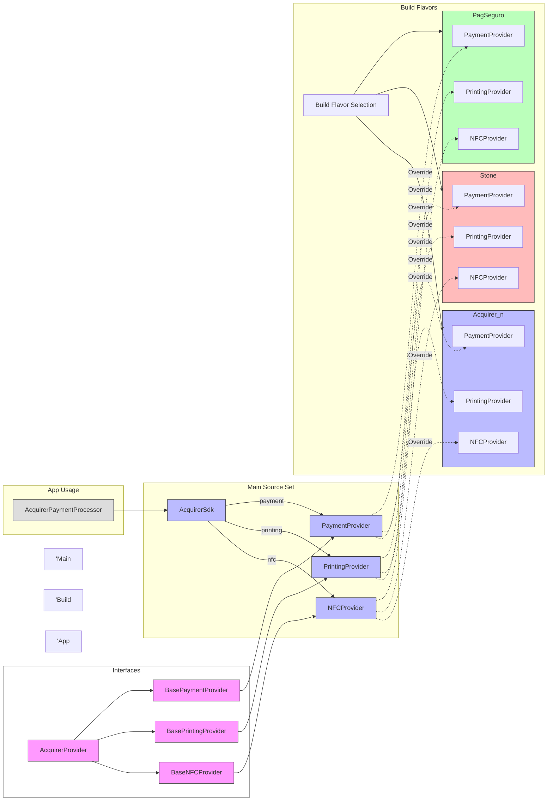

# Acquirer SDK Architecture

This document describes the architecture of the Acquirer SDK system, which is designed to support multiple acquirer flavors using a source set-based provider pattern.

## Architecture Overview

The Acquirer SDK uses a build flavor-based architecture that allows for different payment processors (PagSeguro, Stone, etc.) to be used without changing the client code. This is achieved through:

1. **Common interfaces** in the main source set
2. **Provider objects** that serve as access points for implementations
3. **Flavor-specific implementations** in separate source sets
4. **Build system selection** of the appropriate implementation at build time

## Architecture Diagram



## How It Works

1. **Interface Layer**:
   - `AcquirerProvider` - Base interface for all provider types
   - Specific interfaces extend this base: `BasePaymentProvider`, `BasePrintingProvider`, `BaseNFCProvider`

2. **Access Layer**:
   - `AcquirerSdk` - Central access point for all providers
   - Exposes properties: `payment`, `printing`, `nfc` to access provider instances

3. **Provider Objects**:
   - `PaymentProvider`, `PrintingProvider`, `NFCProvider` - Singleton objects that return instances
   - Main source set contains default implementations that throw `NotImplementedError`

4. **Flavor Implementation**:
   - Each flavor (PagSeguro, Stone, etc.) provides its own implementations
   - These override the providers from the main source set
   - All use the same class names, allowing seamless replacement

5. **Build System Selection**:
   - Android Gradle build system selects the appropriate source set based on build flavor
   - No runtime conditionals needed in code

## Usage

```kotlin
// Initialize all providers with application context
AcquirerSdk.initialize(applicationContext)

// Access a provider
val paymentProvider = AcquirerSdk.payment

// Use the provider (implementation automatically selected based on build flavor)
if (paymentProvider.isInitialized()) {
    // Use the provider
}
```

## Extensibility

The architecture is designed to be easily extensible:

1. **Adding new provider types** - Create a new interface extending `AcquirerProvider` and add a corresponding accessor in `AcquirerSdk`

2. **Adding new flavors** - Create a new source set for the flavor and implement the provider interfaces
