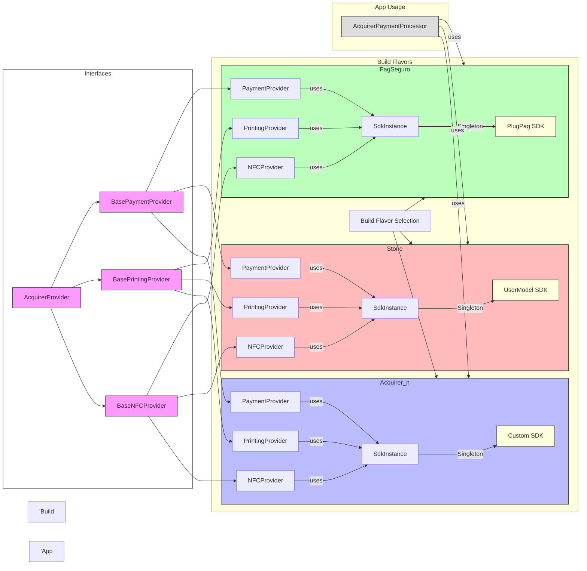

# Acquirer SDK Architecture

This document describes the architecture of the Acquirer SDK system, which is designed to support multiple acquirer flavors using a source set-based provider pattern with flavor-specific type safety and shared SDK instances.

## Architecture Overview

The Acquirer SDK uses a build flavor-based architecture that allows for different payment processors (PagSeguro, Stone, etc.) to be used without changing the client code. This is achieved through:

1. **Common interfaces** in the main source set (`/sdk/` directory)
2. **Flavor-specific implementations** in separate source sets (`pagseguro/`, `stone/`)
3. **Build system selection** of the appropriate implementation at build time
4. **Singleton SDK instances** shared across providers within each flavor
5. **Flavor-specific type safety** ensuring proper typing and compile-time safety
6. **Central access point** through `AcquirerSdk` object in each flavor

## Architecture Diagram



## How It Works

1. **Interface Layer**:
   - `AcquirerProvider` - Base interface for all provider types
   - Specific interfaces extend this base: `BasePaymentProvider<T>`, `BasePrintingProvider<T>`, `BaseNFCProvider<T>`
   - Type parameter `<T>` allows flavor-specific SDK type to be enforced

2. **Flavor Implementation**:
   - Each flavor (PagSeguro, Stone, etc.) provides its own complete implementations
   - Located in separate source sets: `app/src/pagseguro/`, `app/src/stone/`
   - All use the same class names and package structure, allowing seamless build-time replacement

3. **Access Layer**:
   - `AcquirerSdk` - Central access point object in each flavor
   - Exposes properties: `payment`, `printing`, `nfc` to access provider instances
   - Each property returns a flavor-specific typed instance

4. **SDK Instance Management**:
   - `SdkInstance` - Singleton object that manages the flavor-specific SDK instance
   - Ensures only one SDK instance is created and shared across all providers
   - Each flavor provides its own implementation (e.g., PagSeguro → PlugPag, Stone → UserModel)

5. **Provider Objects**:
   - `PaymentProvider`, `PrintingProvider`, `NFCProvider` - Singleton objects that provide type-safe access
   - Each provider maintains its own initialization state
   - All providers delegate to the shared `SdkInstance` for the actual SDK instance

6. **Type Safety**:
   - Providers expose flavor-specific types enabling proper type inference
   - This ensures compile-time safety for flavor-specific features

7. **Build System Selection**:
   - Android Gradle build system selects the appropriate source set based on build flavor
   - No runtime conditionals needed in code

## Current Implementation

The SDK currently includes the following files:

### Main Source Set (`/sdk/`)
- `AcquirerProvider.kt` - Base interface with `initialize()` and `isInitialized()` methods
- `payment/BasePaymentProvider.kt` - Generic payment provider interface with `getInstance()` method
- `nfc/BaseNFCProvider.kt` - Generic NFC provider interface with `getInstance()` method  
- `printing/BasePrintingProvider.kt` - Generic printing provider interface with `getInstance()` method

### PagSeguro Flavor (`app/src/pagseguro/`)
- `AcquirerSdk.kt` - Central access object returning `BasePaymentProvider<PlugPag>` instances
- `SdkInstance.kt` - Singleton managing PlugPag SDK instance
- `payment/PaymentProvider.kt` - PagSeguro payment implementation
- `printing/PrintingProvider.kt` - PagSeguro printing implementation
- `nfc/NFCProvider.kt` - PagSeguro NFC implementation

### Stone Flavor (`app/src/stone/`)
- `AcquirerSdk.kt` - Central access object returning `BasePaymentProvider<UserModel>` instances
- `SdkInstance.kt` - Singleton managing UserModel SDK instance
- `payment/PaymentProvider.kt` - Stone payment implementation
- `printing/PrintingProvider.kt` - Stone printing implementation
- `nfc/NFCProvider.kt` - Stone NFC implementation

## Usage

```kotlin
// Initialize all providers with application context
AcquirerSdk.initialize(applicationContext)

// Access a provider - flavor-specific types inferred automatically
val paymentProvider = AcquirerSdk.payment

// Use the provider (implementation automatically selected based on build flavor)
if (paymentProvider.isInitialized()) {
    // Get the flavor-specific SDK instance
    val sdkInstance = paymentProvider.getInstance()
    
    // Use the flavor-specific SDK features with proper typing
    // Example for PagSeguro:
    // sdkInstance.doPlugPagSpecificOperation() 
    // 
    // Example for Stone:
    // sdkInstance.doStoneSpecificOperation()
}
```

## Extensibility

The architecture is designed to be easily extensible:

1. **Adding new provider types** - Create a new interface extending `AcquirerProvider<T>` and add a corresponding accessor in `AcquirerSdk`

2. **Adding new flavors** - Create a new source set for the flavor and implement:
   - `SdkInstance` - Singleton for managing the flavor's SDK instance
   - Provider implementations that use the shared `SdkInstance`

3. **Enhancing type safety** - Add flavor-specific extension methods or interfaces to the provider objects to expose additional functionality while maintaining type safety

## Benefits of this Architecture

1. **True Singleton SDK** - Only one SDK instance is created and shared across all providers (payment, printing, NFC)

2. **Type Safety** - Proper typing ensures compile-time safety for flavor-specific features

3. **Separation of Concerns** - Each provider is responsible for a specific domain (payment, printing, NFC)

4. **Build-time Selection** - No runtime conditionals or reflection needed

5. **Clean API** - Clients interact with a consistent API regardless of flavor

6. **Testability** - Each component can be easily mocked and tested independently
