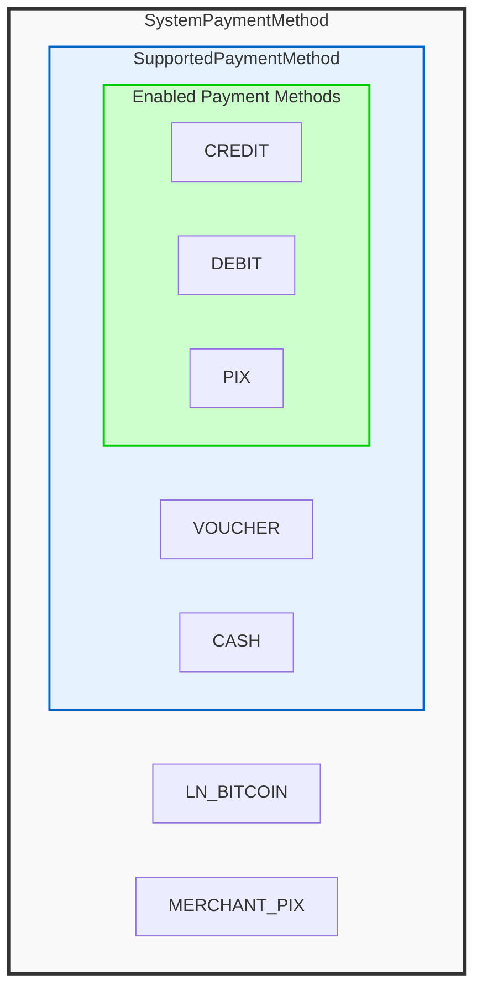
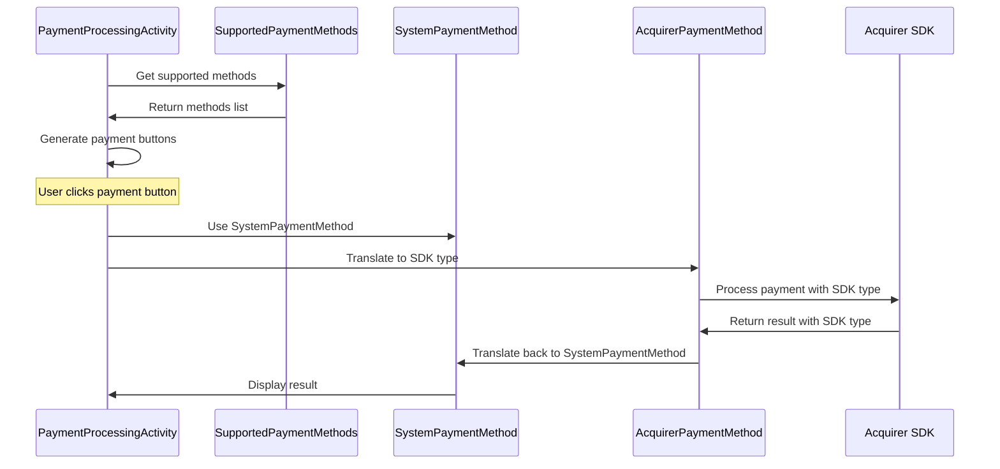

# Payment Methods System Documentation

This document provides comprehensive documentation for the payment methods system, covering the three-tier architecture that manages payment method definitions, acquirer support, and UI rendering.

## Overview

The payment methods system follows a three-tier hierarchy that ensures flexibility, maintainability, and clear separation of concerns:

1. **System Payment Methods** - All theoretically possible payment methods
2. **Supported Payment Methods** - Subset supported by each acquirer flavor  
3. **Menu-Enabled Payment Methods** - Subset received from API

## Architecture Diagram



## File Structure

### 1. SystemPaymentMethod.kt
**Purpose**: Defines the universal payment method vocabulary for the entire system.

**Key Features**:
- Enum with string values for serialization
- `fromValue()` method for deserialization
- Serves as the single source of truth for all payment methods

**Payment Methods Defined**:
- `CREDIT` - Credit card payments
- `DEBIT` - Debit card payments  
- `VOUCHER` - Voucher/meal ticket payments
- `PIX` - Brazil's instant payment system
- `MERCHANT_PIX` - Personal PIX account payments
- `CASH` - Cash payments
- `LN_BITCOIN` - Lightning Network Bitcoin payments

**Usage Example**:
```kotlin
// Creating payment requests
val paymentMethod = SystemPaymentMethod.CREDIT
val paymentData = PaymentData(method = paymentMethod, amount = 1000)

// String serialization
val methodString = SystemPaymentMethod.PIX.value // "pix"
val methodFromString = SystemPaymentMethod.fromValue("pix") // SystemPaymentMethod.PIX
```

### 2. AcquirerPaymentMethod.kt

**Purpose**: Bridges system payment methods with Acquirer SDK transaction types.

**Key Features**:
- Bidirectional translation between SystemPaymentMethod and TypeOfTransactionEnum
- Flavor-specific implementation
- Fallback to PIX for unmapped methods

**Supported Mappings** (Acquirer):
- `VOUCHER` ↔ `TypeOfTransactionEnum.VOUCHER`
- `DEBIT` ↔ `TypeOfTransactionEnum.DEBIT`
- `CREDIT` ↔ `TypeOfTransactionEnum.CREDIT`
- `PIX` ↔ `TypeOfTransactionEnum.PIX`

**Translation Methods**:
```kotlin
// System to Acquirer SDK translation
val systemMethod = SystemPaymentMethod.CREDIT
val acquirerType = AcquirerPaymentMethod.translate(systemMethod)
// acquirerType = TypeOfTransactionEnum.CREDIT

// Acquirer SDK to system translation
val acquirerResponse = TypeOfTransactionEnum.PIX
val systemMethod = AcquirerPaymentMethod.translate(acquirerResponse)
// systemMethod = SystemPaymentMethod.PIX
```

### 3. SupportedPaymentMethods.kt

**Purpose**: Defines which payment methods are supported and enabled for each acquirer flavor (based on acquirer specific rules).

**Key Features**:
- Flavor-specific configuration (build system selects correct file)
- Simple list format for easy maintenance

**Stone Configuration**:
```kotlin
val methods = listOf(
    SystemPaymentMethod.PIX,
    SystemPaymentMethod.CASH,
    SystemPaymentMethod.LN_BITCOIN,
    SystemPaymentMethod.MERCHANT_PIX,
)
```

**PagSeguro Configuration**:
```kotlin
val methods = listOf(
    SystemPaymentMethod.CREDIT,
    SystemPaymentMethod.DEBIT,
    SystemPaymentMethod.VOUCHER,
    SystemPaymentMethod.PIX,
    SystemPaymentMethod.CASH,
)
```

## Dynamic UI Generation

The `PaymentProcessingActivity` uses the `SupportedPaymentMethods.methods` list to dynamically generate payment buttons:

```kotlin
private fun generatePaymentMethodButtons() {
    val container = findViewById<LinearLayout>(R.id.payment_methods_container)
    val supportedMethods = SupportedPaymentMethods.methods
    
    // Clear any existing buttons
    container.removeAllViews()
    
    // Create buttons dynamically
    supportedMethods.forEach { method ->
        val button = Button(this).apply {
            text = getPaymentMethodDisplayName(method)
            setOnClickListener {
                enqueuePayment(method)
            }
        }
        container.addView(button)
    }
}
```

## Benefits of This Architecture

### 1. **Flexibility**
- Easy to add new payment methods system-wide
- Each acquirer can support different subsets
- UI can be customized per acquirer without code changes

### 2. **Maintainability**
- Single source of truth for payment method definitions
- Clear separation between system, acquirer, and UI concerns
- Easy to enable/disable payment methods for testing

### 3. **Consistency**
- Unified payment method vocabulary across the entire system
- Consistent behavior regardless of acquirer
- Type-safe translations between system and SDK types

### 4. **Extensibility**
- New acquirers can be added by creating new flavor-specific files
- New payment methods can be added to SystemPaymentMethod
- UI automatically adapts to supported payment methods

## Configuration Management

### Adding a New Payment Method
1. Add the new method to `SystemPaymentMethod.kt`
2. Add translation mapping in `AcquirerPaymentMethod.kt` (if supported by SDK)
3. Add to `SupportedPaymentMethods.kt` for relevant acquirers
4. Add display name mapping in `PaymentProcessingActivity.getPaymentMethodDisplayName()`

### Temporarily Disabling a Payment Method
1. Comment out the method in the relevant `SupportedPaymentMethods.kt` file
2. The UI will automatically hide the button for that method

### Testing Different Configurations
1. Modify the `SupportedPaymentMethods.methods` list
2. Rebuild the app to see the changes in the UI
3. Use different combinations for A/B testing or gradual rollouts

## Integration Flow



This architecture ensures that the payment system is both flexible and maintainable, allowing for easy configuration changes while maintaining consistency across different acquirer integrations.
